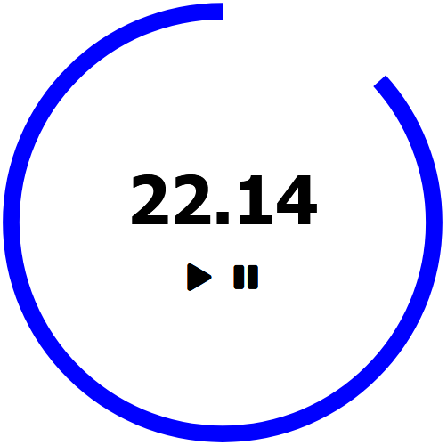

# basicTimer

<ul>
  <li>Basic vanilla js clock</li>
  <li>Timer updates on input</li>
  <li>Circle SVG used for timer countdown animation</li>
  <li>Timer created with class constructor</li>
</ul>

